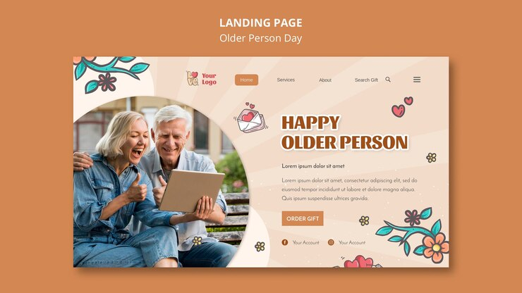
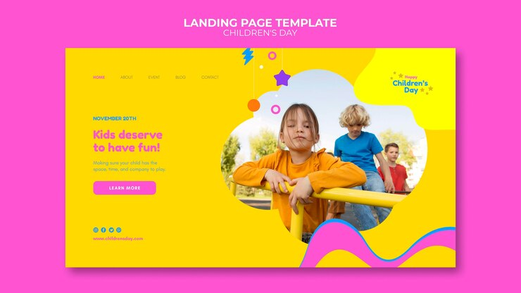
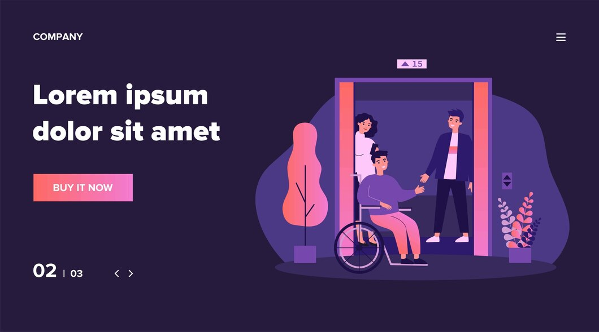

<p align="center">
  
</p>

<h1 align="center">ADA Company - Projeto Final</h1>

<p align="center">
  <a href="https://newadacompany-3drnxk22f-ada-companys-projects.vercel.app/"></a>
  <a href="https://backend-adacompany.onrender.com/"></a>
</p>

---

## ✨ Sobre o Projeto

Sistema completo para gestão de serviços, clientes e funcionários, com interface web moderna e API robusta.

---

## 🖼️ Demonstração Visual

<p align="center">
  
  
</p>

<p align="center">
  
  
  
</p>

---

## 🚀 Tecnologias Utilizadas

- React + Vite (Frontend)
- NestJS (Backend)
- PostgreSQL (Banco de Dados)
- Docker & Docker Compose
- Nginx (Frontend em produção)

---

## 📦 Como Executar

1. **Clone os repositórios:**
   ```sh
   git clone https://github.com/ADACompany01/backEnd-QuartoSemestre.git
   git clone https://github.com/ADACompany01/frontEnd-QuartoSemestre.git
   ```
2. **Navegue até a pasta do docker-compose:**
   ```sh
   cd backEnd-QuartoSemestre/API_NEST/API_ADA_COMPANY_NESTJS
   ```
3. **Suba os containers:**
   ```sh
   docker-compose up -d --build
   ```
4. **Acesse:**
   - Frontend: [http://localhost](http://localhost)
   - Backend: [http://localhost:3000](http://localhost:3000)

---

## 🌐 Links das Aplicações Publicadas

- **Frontend:** [https://newadacompany-3drnxk22f-ada-companys-projects.vercel.app/](https://newadacompany-3drnxk22f-ada-companys-projects.vercel.app/)
- **Backend:** [https://backend-adacompany.onrender.com/](https://backend-adacompany.onrender.com/)

---

## 👥 Integrantes

- Luiz Riato
- Matheus Prusch
- Maycon Sanches
- Pietro Adrian
- Samuel Pregnolatto

---

## 📄 Documentação e Repositórios

- [Repositório Backend](https://github.com/ADACompany01/backEnd-QuartoSemestre)
- [Repositório Frontend](https://github.com/ADACompany01/frontEnd-QuartoSemestre)

---

## 📸 Mais Imagens

- 
- 
- 
- 
- 

---

## 📄 Licença

Este projeto está sob a licença MIT. 
